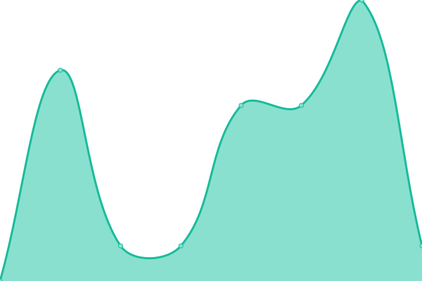

# [📈 Live Status](https://ApfelBirneKreis.github.io/Status): <!--live status--> **🟧 Partial outage**

This repository contains the open-source uptime monitor and status page for [ApfelBirneKreis](https://ApfelBirneKreis.github.io/Status), powered by [Upptime](https://github.com/upptime/upptime).

With [Upptime](https://upptime.js.org), you can get your own unlimited and free uptime monitor and status page, powered entirely by a GitHub repository. We use [Issues](https://github.com/ApfelBirneKreis/Status/issues) as incident reports, [Actions](https://github.com/ApfelBirneKreis/Status/actions) as uptime monitors, and [Pages](https://ApfelBirneKreis.github.io/Status) for the status page.

<!--start: status pages-->
<!-- This summary is generated by Upptime (https://github.com/upptime/upptime) -->
<!-- Do not edit this manually, your changes will be overwritten -->
<!-- prettier-ignore -->
| URL | Status | History | Response Time | Uptime |
| --- | ------ | ------- | ------------- | ------ |
|  [Plex](streaming.edithserver.eu) | 🟩 Up | [plex.yml](https://github.com/ApfelBirneKreis/Status/commits/HEAD/history/plex.yml) | 

 6ms
     
 | 

<a href="https://ApfelBirneKreis.github.io/Status/history/plex">100.00%</a>
    

|  [Mealie](mealie.edithserver.eu) | 🟥 Down | [mealie.yml](https://github.com/ApfelBirneKreis/Status/commits/HEAD/history/mealie.yml) | 

 552ms
     
 | 

<a href="https://ApfelBirneKreis.github.io/Status/history/mealie">99.61%</a>
    

|  [Chia-Node](node.edithserver.eu) | 🟥 Down | [chia-node.yml](https://github.com/ApfelBirneKreis/Status/commits/HEAD/history/chia-node.yml) | 

 0ms
     
 | 

<a href="https://ApfelBirneKreis.github.io/Status/history/chia-node">0.00%</a>
    

<!--end: status pages-->

[**Visit our status website →**](https://ApfelBirneKreis.github.io/Status)

## 📄 License

- Powered by: [Upptime](https://github.com/upptime/upptime)
- Code: [MIT](./LICENSE) © [ApfelBirneKreis](https://ApfelBirneKreis.github.io/Status)
- Data in the `./history` directory: [Open Database License](https://opendatacommons.org/licenses/odbl/1-0/)
